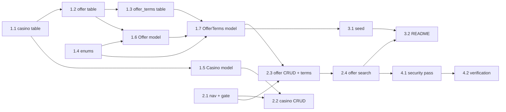

Offers Module — Admin (Backend) Implementation Plan
===================================================

**Goal:** the admin half of the Offers module — schema, shared domain models,
validated CRUD for `casino` and `offer`, a filterable/sortable/paginated offer
list, and seed data — on the existing Yii2 advanced scaffold.

**Scope:** `console/migrations/`, `common/` (enums, models, fixtures),
`backend/` (controllers, search models, views), `console/controllers/` (seed).

**Out of scope (not planned, not touched here):** the public `/offers` and
`/offer/<slug>` pages and `/sitemap.xml` — they live in the `frontend/`
application and get their own plan. The domain models and query scopes built in
Epic 1 are the seam they will reuse, so nothing in this plan hardcodes admin-only
assumptions into `common/`.

Stack facts (verified in this repo)
-----------------------------------

| item | value |
|------|-------|
| framework | `yiisoft/yii2` 2.0.55, advanced template |
| PHP | 8.4.22 (`composer.json` floor: `>=8.2`) |
| DB | MySQL 8.4 — `yii2_offers`, tests on `yii2_offers_test`; `CHECK` constraints are enforced (verified: violating insert fails with `ERROR 3819`) |
| UI | `yiisoft/yii2-bootstrap5` 2.0.51 (`ActiveForm`, `Nav`, `LinkPager`), core `yii\grid\GridView` |
| tests | Codeception 5 — `backend/tests/{Unit,Functional}`, `common/tests/Unit` |
| dev tools | Gii and Debug modules enabled in `backend/config/main-local.php` under `YII_ENV_DEV` |

Data model decision: terms are a child table
--------------------------------------------

The brief lists `terms` as one field on `offer`. A free-text blob is the wrong
surface: bonus terms are a small, fixed, numeric vocabulary (wagering, minimum
deposit, caps, validity window) that the admin filters and sorts on and the
public detail page renders field by field. They are modelled as a **strict 1:1
child table** `offer_terms`:

- `offer_terms.offer_id` is **both primary key and foreign key**
  (`ON DELETE CASCADE`), so exactly zero or one terms row can exist per offer —
  no duplicates are representable, no surrogate id, no ordering column.
- `offer` stays narrow and is the only table the listing query reads; terms are
  joined or eager-loaded only where they are shown or filtered.
- Terms are optional as a group (an offer can exist before its terms are
  entered) instead of seven nullable columns on the main table.
- Numeric fields are real typed columns, so "wagering ≤ 35" is an indexed
  `WHERE`, sorting works through `ActiveDataProvider`, and ranges are enforced by
  `CHECK` constraints in addition to model rules.

Rejected alternatives, recorded so the choice is reviewable:

- **MySQL `JSON` column.** MySQL has `JSON`, not Postgres `jsonb`. The database
  would validate nothing beyond well-formedness, every filter would become
  `JSON_EXTRACT(...)` with no index unless a generated column is added per key
  (which is just columns with extra steps), and sorting via `Sort::$attributes`
  gets awkward. JSON fits write-rarely / read-whole / never-filtered payloads;
  terms are the opposite.
- **EAV child table** (`offer_term(offer_id, label, value, position)`). `value`
  as a string kills range queries and typed validation, and a list view invites
  one query per offer. It is the right shape only for arbitrary free-form bullet
  lists; if that is wanted later it is purely additive next to the typed table.

Global constraints
------------------

1. **Shared models live in `common/models/`.** `backend` and the future
   `frontend` both consume them; no duplicated AR classes.
2. **Every schema change is a migration** in `console/migrations/`, applied with
   `php yii migrate` and `php yii_test migrate`. Both `safeUp()` and
   `safeDown()` must work — `migrate/down 3` has to leave a clean database.
3. **Timestamps follow the template:** `created_at` / `updated_at` are unix ints
   fed by `TimestampBehavior`, exactly like `{{%user}}`. `expires_at` is a
   user-entered `DATETIME` instead, because it is displayed, validated against
   "now", and later becomes sitemap `lastmod` input.
4. **Enum columns are MySQL `ENUM`**, mirrored by PHP 8 backed enums in
   `common/enums/`. The DB enforces the domain, the enum class is the single
   source of truth for labels and for the `in` validator range. MySQL-only is
   acceptable: the app and both test databases are MySQL 8.4.
5. **No raw SQL string interpolation.** Filters go through `andFilterWhere()` /
   parameter binding; sorting through an explicit `Sort::$attributes` whitelist.
6. **Escaping is explicit.** `Html::encode()` for any echoed attribute,
   `GridView` columns keep default encoding, `raw` format is never used on user
   data. CSRF stays enabled (`_csrf-backend`); every mutating action is
   POST-only via `VerbFilter`.
7. **No unbounded queries.** Every list endpoint is paginated; every offer list
   eager-loads the relations it renders.
8. **Writes that span `offer` + `offer_terms` run in one transaction.**
9. **Commits are Conventional Commits in English**, one per story, and are only
   created when the repository owner asks for them.

Definition of done for every story: code written, the named verification command
run and passing, and the story's acceptance criteria observable in the running
app (`php yii serve --port=8081 --docroot=@backend/web`).

---

Epic 1 — Schema and shared domain
---------------------------------

Produces the tables, the enum vocabulary, and the ActiveRecord classes with
validation that actually holds. Nothing in this epic depends on `backend/`.

### Story 1.1 — `casino` table migration

**Files:** create `console/migrations/mYYMMDD_HHMMSS_create_casino_table.php`

| column | type | notes |
|--------|------|-------|
| `id` | `primaryKey()` | |
| `name` | `string(120)->notNull()` | |
| `slug` | `string(140)->notNull()` | unique index `idx-casino-slug` |
| `rating` | `decimal(2,1)->notNull()->defaultValue(0)` | 0.0–5.0 |
| `is_active` | `boolean()->notNull()->defaultValue(true)` | `TINYINT(1)` |
| `created_at` | `integer()->notNull()` | |
| `updated_at` | `integer()->notNull()` | |

Table options when `$this->db->driverName === 'mysql'`:
`CHARACTER SET utf8mb4 COLLATE utf8mb4_unicode_ci ENGINE=InnoDB` (same guard
style as the `init` migration, utf8mb4 to match the app's charset config).
Index `idx-casino-is_active` on `is_active` (the public listing filters on it).
`CHECK (rating >= 0 AND rating <= 5)`.

**Acceptance:** `php yii migrate --interactive=0` then
`php yii migrate/down 1 --interactive=0` both succeed; `SHOW CREATE TABLE casino`
shows the unique slug index, the check constraint and utf8mb4; inserting
`rating = 9` fails at the DB level.

**Commit:** `feat(db): add casino table migration`

### Story 1.2 — `offer` table migration

**Files:** create `console/migrations/mYYMMDD_HHMMSS_create_offer_table.php`

| column | type | notes |
|--------|------|-------|
| `id` | `primaryKey()` | |
| `casino_id` | `integer()->notNull()` | FK |
| `title` | `string(160)->notNull()` | |
| `slug` | `string(180)->notNull()` | unique index `idx-offer-slug` |
| `type` | `"ENUM('welcome','no_deposit','free_spins') NOT NULL"` | raw type string |
| `amount` | `decimal(12,2)->notNull()` | currency for deposit offers, spin count for `free_spins` |
| `expires_at` | `dateTime()` | nullable = never expires |
| `status` | `"ENUM('draft','active','expired') NOT NULL DEFAULT 'draft'"` | raw type string |
| `created_at` / `updated_at` | `integer()->notNull()` | |

Foreign key `fk-offer-casino_id` → `casino(id)`, `ON DELETE CASCADE`,
`ON UPDATE CASCADE` — an offer cannot outlive its casino.
`CHECK (amount >= 0)`.

Indexes, chosen for the real access paths:
- `idx-offer-casino_id` on `casino_id` — admin filter and relation lookups.
- `idx-offer-type` on `type` — admin and public filters.
- `idx-offer-status-expires_at` on `(status, expires_at)` — the public predicate
  `status = 'active' AND (expires_at IS NULL OR expires_at > NOW())` and the
  sitemap query.

`safeDown()` drops the FK before the table.

**Acceptance:** migrate up/down clean; `EXPLAIN` on the public predicate reports
`idx-offer-status-expires_at` in `possible_keys`; inserting an unknown `type`
is rejected by MySQL; deleting a casino removes its offers.

**Commit:** `feat(db): add offer table migration`

### Story 1.3 — `offer_terms` table migration

**Files:** create `console/migrations/mYYMMDD_HHMMSS_create_offer_terms_table.php`

| column | type | notes |
|--------|------|-------|
| `offer_id` | `integer()->notNull()` | **PRIMARY KEY and FK** — enforces 1:1 |
| `wagering_multiplier` | `decimal(5,1)` | `35.0` renders as "35x"; NULL = none |
| `min_deposit` | `decimal(10,2)` | NULL for `no_deposit` / `free_spins` |
| `max_bonus` | `decimal(10,2)` | cap on the granted bonus |
| `max_cashout` | `decimal(10,2)` | cap on withdrawable winnings |
| `valid_days` | `smallInteger()` | days to use the offer after claiming |
| `terms_url` | `string(255)` | link to the casino's full legal T&C |
| `terms_note` | `string(500)` | short residual caveat, plain text |
| `created_at` / `updated_at` | `integer()->notNull()` | |

```php
$this->addPrimaryKey('pk-offer_terms-offer_id', '{{%offer_terms}}', 'offer_id');
$this->addForeignKey(
    'fk-offer_terms-offer_id',
    '{{%offer_terms}}',
    'offer_id',
    '{{%offer}}',
    'id',
    'CASCADE',   // delete
    'CASCADE',   // update
);
```

`CHECK` constraints (MySQL 8.4 enforces them — verified):

```sql
CHECK (wagering_multiplier IS NULL OR wagering_multiplier BETWEEN 0 AND 200)
CHECK (min_deposit  IS NULL OR min_deposit  >= 0)
CHECK (max_bonus    IS NULL OR max_bonus    >= 0)
CHECK (max_cashout  IS NULL OR max_cashout  >= 0)
CHECK (valid_days   IS NULL OR valid_days BETWEEN 1 AND 365)
```

Index `idx-offer_terms-wagering_multiplier` on `wagering_multiplier` — the admin
list gets a "max wagering" filter (Story 2.4).

**Acceptance:** migrate up/down clean; inserting two rows with the same
`offer_id` fails on the primary key; `wagering_multiplier = 500` fails the check;
deleting an offer removes its terms row; `SHOW CREATE TABLE offer_terms` shows
`PRIMARY KEY (offer_id)` and the FK.

**Commit:** `feat(db): add offer terms table migration`

### Story 1.4 — enum vocabulary

**Files:** create `common/enums/OfferType.php`, `common/enums/OfferStatus.php`

```php
enum OfferType: string
{
    case Welcome = 'welcome';
    case NoDeposit = 'no_deposit';
    case FreeSpins = 'free_spins';

    /** @return list<string> */
    public static function values(): array
    {
        return array_column(self::cases(), 'value');
    }

    /** @return array<string,string> value => human label, for dropdowns */
    public static function labels(): array
    {
        return [
            self::Welcome->value => 'Welcome bonus',
            self::NoDeposit->value => 'No deposit',
            self::FreeSpins->value => 'Free spins',
        ];
    }

    public function label(): string
    {
        return self::labels()[$this->value];
    }
}
```

`OfferStatus` has the same shape for `draft` / `active` / `expired`.
`values()` feeds every `in` validator; `labels()` feeds every `ActiveForm`
dropdown and `GridView` filter, so admin copy has one source.

Both enums also expose `labelFor(?string $value): string`, because AR
attributes are raw strings in views and `OfferType::from($offer->type)` would
throw on unexpected data.

**Acceptance (as built):** `common/tests/Unit/Enums/OfferTypeTest.php` and
`OfferStatusTest.php` assert the exact `values()` order, that `labels()` has a
key for every case and no extras, that `labelFor()` returns `''` for unknown
and `null` input — plus a **drift guard** that reads the live column
definition, since the PHP enum and the MySQL `ENUM` are two declarations of one
domain:

```php
$column = Yii::$app->db->getTableSchema('{{%offer}}', true)?->getColumn('type');
self::assertSame(OfferType::values(), $column->enumValues);
```

Adding a case without a migration (or vice versa) then fails in CI instead of
at insert time.
Run: `php vendor/bin/codecept run common/tests/Unit`.

**Commit:** `feat(domain): add offer type and status enums`

### Story 1.5 — `Casino` model

**Files:** create `common/models/Casino.php`

- `tableName(): '{{%casino}}'`.
- `behaviors()` — `TimestampBehavior::class` plus the framework's own slug
  generator, which already has the semantics the brief asks for:

```php
[
    'class' => SluggableBehavior::class,   // yii\behaviors\SluggableBehavior
    'attribute' => 'name',                 // 'title' on Offer
    'slugAttribute' => 'slug',
    'ensureUnique' => true,                // appends -2, -3, ... on collision
    'immutable' => true,                   // a slug the admin typed is kept as-is
]
```

  `SluggableBehavior::isNewSlugNeeded()` regenerates only while `slug` is empty
  (`immutable => true` short-circuits otherwise), so "auto-generate from the
  name/title when left empty" needs no custom code, and `ensureUnique` keeps the
  unique index intact. The behavior runs on `beforeValidate`, so the `unique` and
  `match` rules below still see the generated value.
- Rules:
  - `name` — `trim`, `required`, `string` max 120.
  - `slug` — `trim`, `string` max 140, `match` `/^[a-z0-9]+(?:-[a-z0-9]+)*$/`,
    `unique`; **not** `required` (the behavior fills it).
  - `rating` — `required`, `number` with `min => 0`, `max => 5`.
  - `is_active` — `boolean`, `default` value `true`.
- `getOffers(): ActiveQuery` — `hasMany(Offer::class, ['casino_id' => 'id'])`.
  **Deferred to Story 1.6** during implementation: `Offer` does not exist yet at
  this point and the repo's PHPStan run (level 5) fails the forward reference
  with three `class.notFound` errors. The relation and its `@property-read`
  docblock are added when `Offer` lands.
- `attributeLabels()` — `is_active` as "Active", `rating` as "Rating (0-5)".

**Acceptance:** `common/tests/Unit/Models/CasinoTest.php` covers: blank slug is
derived from the name; a second casino with the same name gets `-2`;
`rating = 6` fails; an explicitly typed `slug = 'Not A Slug'` fails the pattern
and is not rewritten by the behavior.
Run: `php vendor/bin/codecept run common/tests/Unit`.

**Commit:** `feat(domain): add casino model with slug generation`

### Story 1.6 — `Offer` model and query scopes

**Files:** create `common/models/Offer.php`, `common/models/OfferQuery.php`

- `behaviors()` — `TimestampBehavior::class` plus `SluggableBehavior` configured
  as in Story 1.5 but with `'attribute' => 'title'`, same `ensureUnique` and
  `immutable` pair.
- Rules:
  - `casino_id` — `required`, `integer`, `exist` with
    `targetClass => Casino::class, targetAttribute => 'id'`.
  - `title` — `trim`, `required`, `string` max 160.
  - `slug` — `trim`, `string` max 180, `match` `/^[a-z0-9]+(?:-[a-z0-9]+)*$/`,
    `unique`; not `required` — the behavior derives it from `title`.
  - `type` — `required`, `in` with `range => OfferType::values()`.
  - `status` — `required`, `in` with `range => OfferStatus::values()`,
    `default` `OfferStatus::Draft->value`.
  - `amount` — `required`, `number`, `min => 0`.
  - `expires_at` — `datetime` with `format => 'php:Y-m-d H:i:s'`, plus inline
    validator `validateExpiresAtInFuture()` rejecting a value `<= now()` **only
    when the attribute changed** (`$this->isAttributeChanged('expires_at')`), so
    an old record whose date has passed can still be edited and moved to
    `expired`. Null is allowed.
  - Consistency: `status = 'active'` together with an already-past `expires_at`
    is rejected with the error attached to `status` ("an expired offer cannot be
    active"). Implemented as a **second, separate** inline validator
    (`validateStatusAgainstExpiry()`), not as part of the expiry rule: it must
    fire even when `expires_at` was not touched in this request, while
    `validateExpiresAtInFuture()` must not.
- `isExpired(): bool` — helper used by views and by the status rule's tests.
- Relations:
  - `getCasino(): ActiveQuery` — `hasOne(Casino::class, ['id' => 'casino_id'])`.
  - `getTerms(): ActiveQuery` — `hasOne(OfferTerms::class, ['offer_id' => 'id'])`.
    **Deferred to Story 1.7** for the same reason as `Casino::getOffers()`:
    `OfferTerms` does not exist yet and PHPStan rejects the forward reference.
- `public static function find(): OfferQuery` with:
  - `active()` — `andWhere(['offer.status' => OfferStatus::Active->value])`
  - `notExpired()` — `andWhere(['or', ['offer.expires_at' => null], ['>', 'offer.expires_at', date('Y-m-d H:i:s')]])`.
    The boundary is a **PHP-bound timestamp, not MySQL `NOW()`**: validation
    compares against PHP's clock, MySQL's `@@session.time_zone` defaults to
    `SYSTEM`, and two clocks would let a row be "expired" for the validator and
    "live" for the query. Verified that the bound literal still uses
    `idx-offer-status-expires_at` (`EXPLAIN` reports the index).
  - `withCasino()` — `with(['casino'])`
  - `withTerms()` — `with(['terms'])`. **Deferred to Story 1.7** with the relation.
  These are the listing and sitemap primitives; the admin search model uses
  `withCasino()`, the detail views add `withTerms()`.
- `saveWithTerms(OfferTerms $terms): bool` — the aggregate write, so controllers
  stay thin and the transaction rule cannot be forgotten. **Deferred to Story
  1.7**, since its parameter type is `OfferTerms`:

```php
public function saveWithTerms(OfferTerms $terms): bool
{
    $transaction = static::getDb()->beginTransaction();
    try {
        if (!$this->save(false)) {            // already validated by the caller
            $transaction->rollBack();
            return false;
        }
        $terms->offer_id = $this->id;
        if (!$terms->save(false)) {
            $transaction->rollBack();
            return false;
        }
        $transaction->commit();
        return true;
    } catch (\Throwable $e) {
        $transaction->rollBack();
        throw $e;
    }
}
```

**Acceptance (as built, 16 cases):** `common/tests/Unit/Models/OfferTest.php`
covers: unknown `type` and unknown `status` fail; `casino_id` pointing at a
missing casino fails; a malformed `expires_at` (`31/12/2030`) fails; a new
`expires_at` in the past fails while a future one and `null` pass; a **stored**
past expiry can still be edited (title change validates); publishing that same
lapsed row fails on `status`; `status` defaults to `draft`; blank slug derived
from title and made unique (`visible-welcome-bonus-2`); negative `amount`
fails; `Offer::find()->active()->notExpired()` returns exactly `[1, 2]` of the
five fixture rows; `withCasino()` populates the relation on every row;
`Casino::findOne(2)->offers` returns that casino's offers; `isExpired()`
matches the stored date.
Fixtures: `common/fixtures/{CasinoFixture,OfferFixture}.php` plus
`common/tests/Support/data/{casino,offer}.php`. `OfferFixture::$depends`
names `CasinoFixture` because the FK forbids the other order. One fixture row
(`activeButLapsed`) is deliberately in a state the model rules forbid —
`status = 'active'` with a past expiry — because that is exactly the stale row
`notExpired()` must hide, and only direct table writes can produce it.
`saveWithTerms()` coverage moves to Story 1.7 with the method itself.
Run: `php yii_test migrate --interactive=0 && php vendor/bin/codecept run common/tests/Unit`.

**Commit:** `feat(domain): add offer model with validation and query scopes`

### Story 1.7 — `OfferTerms` model

**Files:** create `common/models/OfferTerms.php`,
`common/fixtures/OfferTermsFixture.php`,
`common/tests/Support/data/offer_terms.php`; modify `common/models/Offer.php`
and `common/models/OfferQuery.php`

**Also lands here** (deferred out of Story 1.6, where the class did not exist
yet and PHPStan rejected the forward references):
- `Offer::getTerms(): ActiveQuery` plus its `@property-read` docblock entry;
- `OfferQuery::withTerms()`;
- `Offer::saveWithTerms(OfferTerms $terms): bool` and its rollback test.

- `tableName(): '{{%offer_terms}}'`, `behaviors(): [TimestampBehavior::class]`,
  primary key is `offer_id` (Yii reads it from the schema; no override needed).
- `public ?string $offerType = null;` — **validation context**, not a column.
  The type-dependent rules live here, but the discriminator lives on the parent,
  so the caller sets `$terms->offerType = $offer->type` before validating. The
  relation is not used for this because on create the parent has no id yet.
- Rules:
  - `wagering_multiplier` — `number`, `min => 0`, `max => 200`.
  - `min_deposit`, `max_bonus`, `max_cashout` — `number`, `min => 0`.
  - `valid_days` — `integer`, `min => 1`, `max => 365`.
  - `terms_url` — `url` with `defaultScheme => 'https'`, `string` max 255.
  - `terms_note` — `trim`, `string` max 500.
  - `min_deposit` — `required` `when` `fn (self $m) => $m->offerType === OfferType::Welcome->value`
    (a welcome bonus without a minimum deposit is meaningless).
  - `min_deposit` — must be empty for a no-deposit offer: inline validator
    `validateNotApplicable()` `when`
    `fn (self $m) => $m->offerType === OfferType::NoDeposit->value`.
  - `max_cashout` — `compare` with `compareAttribute => 'max_bonus'`,
    `operator => '>='`, `skipOnEmpty => true` (a cap below the bonus is a typo).
  - `['!offer_id', 'safe']` is **not** declared — `offer_id` is never mass
    assigned; `saveWithTerms()` sets it.
- `getOffer(): ActiveQuery` — `hasOne(Offer::class, ['id' => 'offer_id'])`.
- `isEmpty(): bool` — true when every user-facing attribute is null/`''`.
  Drives the lifecycle of the optional row inside `saveWithTerms()`: an empty
  terms object is **not written**, and blanking out an existing one **deletes**
  the row, so `offer_terms` never accumulates all-null noise. After a
  successful write the relation is repopulated on the offer, so callers do not
  see a stale value.
- `attributeLabels()` — "Wagering (x)", "Min deposit", "Max bonus",
  "Max cashout", "Valid for (days)", "Full T&C URL", "Extra note".

**Acceptance (as built, 14 cases):** `common/tests/Unit/Models/OfferTermsTest.php`
covers: `wagering_multiplier` 500 and −1 fail while 200 passes; `valid_days` 0
and 366 fail; `terms_url = 'javascript:alert(1)'` fails the `url` validator
while `example.com/terms` is accepted and rewritten to
`https://example.com/terms` by `defaultScheme`; `max_cashout = 50` under
`max_bonus = 100` fails; `offerType = 'welcome'` without `min_deposit` fails;
`offerType = 'no_deposit'` with a `min_deposit` fails; `offerType = 'free_spins'`
validates with all-null numerics; `isEmpty()` ignores the foreign key and the
timestamps; both relation directions resolve and offer 3 has `terms === null`;
`withTerms()` populates the relation on every row; `saveWithTerms()` writes both
rows, skips an empty terms object, deletes the row when it is blanked out, and
**rolls the offer back** when the terms insert trips
`chk-offer_terms-valid_days` (asserted by offer count and a slug lookup).
Fixtures: `common/fixtures/OfferTermsFixture.php` (`$depends` on
`OfferFixture`) plus `common/tests/Support/data/offer_terms.php`, which gives
terms to offers 1 and 2 only — offers 3–5 exercise the optional side.
Run: `php vendor/bin/codecept run common/tests/Unit`.

**Commit:** `feat(domain): add offer terms model with conditional validation`

---

Epic 2 — Admin CRUD
-------------------

All of it behind the existing login (`common\models\LoginForm`, `AccessControl`
with `roles => ['@']`). Views use `yii\bootstrap5\ActiveForm` and core
`GridView`; layout is the template's `backend/views/layouts/main.php`.

### Story 2.1 — admin shell: access gate and navigation

**Files:** modify `backend/views/layouts/_header.php`

Add `Casinos` (`['/casino/index']`) and `Offers` (`['/offer/index']`) nav items,
both `'visible' => !Yii::$app->user->isGuest`, before the Logout item.

**Acceptance:** logged out, `/index.php?r=offer/index` redirects to `site/login`
(302); logged in, both links render and resolve.

**Commit:** `feat(backend): add casino and offer navigation entries`

### Story 2.2 — casino CRUD

**Files:** create `backend/controllers/CasinoController.php`,
`backend/models/CasinoSearch.php`,
`backend/views/casino/{index,create,update,view,_form}.php`

- Controller `behaviors()`: `AccessControl` (`roles => ['@']` for every action)
  plus `VerbFilter` (`'delete' => ['post']`) — mirrors `SiteController`'s style.
- Actions: `index` (search model → `GridView`), `view`, `create`, `update`,
  `delete` (POST, flash, redirect to `index`), private `findModel(int $id)`
  throwing `NotFoundHttpException`.
- `CasinoSearch extends Casino`: `rules()` narrows to filter attributes
  (`[['id'], 'integer']`, `[['name', 'slug'], 'safe']`, `[['is_active'], 'boolean']`),
  `scenarios()` returns `Model::scenarios()` so the parent's validation does not
  leak into filtering, and `search(array $params): ActiveDataProvider` with
  `pagination => ['pageSize' => 20]`, `sort` whitelisting
  `['id', 'name', 'slug', 'rating', 'is_active', 'created_at']`, filters via
  `andFilterWhere(['like', 'name', $this->name])` and exact matches elsewhere.
- Delete confirmation states the offer count (`$model->getOffers()->count()` —
  one aggregate query, no hydration) because the FK cascades.

**Acceptance (logged in):** creating a casino with a blank slug derives the slug
and flashes success; `rating = 9` redisplays the form with an error and creates
nothing; sorting by `name` toggles; `delete` over GET is rejected.

**Commit:** `feat(backend): add casino CRUD`

### Story 2.3 — offer CRUD with terms

**Files:** create `backend/controllers/OfferController.php`,
`backend/views/offer/{index,create,update,view,_form}.php`

- `behaviors()` as in Story 2.2.
- The form edits **two models in one request**, the framework way:

```php
public function actionCreate(): Response|string
{
    $offer = new Offer();
    $terms = new OfferTerms();

    if (Model::loadMultiple([$offer, $terms], Yii::$app->request->post())) {
        $terms->offerType = $offer->type;                 // validation context
        if (Model::validateMultiple([$offer, $terms]) && $offer->saveWithTerms($terms)) {
            Yii::$app->session->setFlash('success', 'Offer created.');
            return $this->redirect(['view', 'id' => $offer->id]);
        }
    }

    return $this->render('create', ['offer' => $offer, 'terms' => $terms]);
}
```

  `actionUpdate()` is the same shape with
  `$terms = $offer->terms ?? new OfferTerms()`.
  `Model::loadMultiple()` keys on form names (`Offer[...]`, `OfferTerms[...]`),
  so one `ActiveForm` renders both without custom request parsing.
- `_form.php`: `casino_id` dropdown from
  `Casino::find()->select(['name', 'id'])->orderBy('name')->indexBy('id')->column()`
  (one query, no hydration); `type` / `status` dropdowns from the enum label
  maps; `expires_at` a text input with `YYYY-MM-DD HH:MM:SS` placeholder and a
  hint that empty means "never expires"; `slug` with the hint "leave empty to
  generate from the title"; then a `<fieldset>` "Terms" with the seven
  `OfferTerms` fields (`wagering_multiplier`, `min_deposit`, `max_bonus`,
  `max_cashout`, `valid_days` as `numberInput()`, `terms_url` as `url` input,
  `terms_note` as a 3-row textarea with `maxlength => 500`).
- `view.php` renders the offer with `DetailView` and the terms as a second
  `DetailView` over the related model, formatted through
  `Yii::$app->formatter` (`decimal`, `integer`, `url`, `date`); `terms_note`
  prints as `nl2br(Html::encode($terms->terms_note))` — encode first, then
  `nl2br`, never `format => 'raw'`. When `$offer->terms === null` the panel
  shows "No terms recorded".
- `index.php` grid columns: `id`, `title`, casino name via
  `['attribute' => 'casino_id', 'value' => 'casino.name']` (eager-loaded in
  Story 2.4), `type` and `status` through the enum labels, `amount`,
  `terms.wagering_multiplier` rendered as `35x` (eager-loaded), `expires_at`,
  `ActionColumn`.

**Acceptance (logged in):** creating an offer with blank slug, no `expires_at`
and empty terms saves as `draft` with no `offer_terms` row; creating a `welcome`
offer without `min_deposit` redisplays the form with the conditional error **and
writes neither table** (transaction); a past `expires_at` shows the future-date
error; `<script>alert(1)</script>` in `terms_note` renders as visible text on
`view`; updating an offer that already has terms updates the same row rather
than inserting.

**Commit:** `feat(backend): add offer CRUD with terms`

### Story 2.4 — offer search: filters, sorting, pagination, no N+1

**Files:** create `backend/models/OfferSearch.php`; modify
`backend/views/offer/index.php`

- `OfferSearch extends Offer`, `scenarios()` → `Model::scenarios()`, rules:
  `[['id', 'casino_id'], 'integer']`, `[['title', 'slug'], 'safe']`,
  `[['type'], 'in', 'range' => OfferType::values()]`,
  `[['status'], 'in', 'range' => OfferStatus::values()]`,
  `[['maxWagering'], 'number', 'min' => 0]` where
  `public ?string $maxWagering = null;` is a search-only attribute.
  Out-of-range filter input is dropped instead of reaching the query.
- `search(array $params): ActiveDataProvider`:

```php
$query = Offer::find()->withCasino()->withTerms();   // with(['casino', 'terms'])

$dataProvider = new ActiveDataProvider([
    'query' => $query,
    'pagination' => ['pageSize' => 20],
    'sort' => [
        'attributes' => [
            'id', 'title', 'type', 'status', 'amount', 'expires_at', 'created_at',
            'casino_id' => [
                'asc' => ['casino.name' => SORT_ASC],
                'desc' => ['casino.name' => SORT_DESC],
            ],
            'wagering' => [
                'asc' => ['offer_terms.wagering_multiplier' => SORT_ASC],
                'desc' => ['offer_terms.wagering_multiplier' => SORT_DESC],
            ],
        ],
        'defaultOrder' => ['created_at' => SORT_DESC],
    ],
]);

if (!($this->load($params) && $this->validate())) {
    return $dataProvider;
}

$query->joinWith(['casino', 'terms']);   // JOINs for filtering/sorting; with() still eager-loads
$query->andFilterWhere(['offer.casino_id' => $this->casino_id])
      ->andFilterWhere(['offer.type' => $this->type])
      ->andFilterWhere(['offer.status' => $this->status])
      ->andFilterWhere(['like', 'offer.title', $this->title])
      ->andFilterWhere(['<=', 'offer_terms.wagering_multiplier', $this->maxWagering]);
```

  Column names are table-qualified because `joinWith` pulls both relations into
  the query. `joinWith(['terms'])` is a LEFT JOIN, so offers without terms stay
  visible until the wagering filter is actually used.
- Grid filter row: casino dropdown (same `indexBy('id')->column()` list), type
  and status dropdowns from the enum labels, a title text input, and a
  "max wagering" number input.

**N+1 evidence, two independent checks.**

*a) Automated, `backend/tests/Unit/Models/OfferSearchTest.php`* — the logger
records one message per executed query under the `yii\db\Command::*` categories:

```php
private function dbQueryCount(): int
{
    return count(array_filter(
        Yii::getLogger()->messages,
        static fn (array $message): bool => str_starts_with((string) $message[2], 'yii\db\Command::'),
    ));
}

public function testListingDoesNotScaleQueriesWithRowCount(): void
{
    Yii::getLogger()->flushInterval = PHP_INT_MAX;   // keep messages for the assertion

    $before = $this->dbQueryCount();
    $models = (new OfferSearch())->search([])->getModels();   // pageSize 20
    $queriesForPage = $this->dbQueryCount() - $before;

    self::assertCount(20, $models);
    foreach ($models as $offer) {
        self::assertTrue($offer->isRelationPopulated('casino'));
        self::assertTrue($offer->isRelationPopulated('terms'));
        self::assertNotNull($offer->casino->name);            // touching adds no query
    }
    self::assertSame($queriesForPage, $this->dbQueryCount() - $before);
    self::assertLessThanOrEqual(4, $queriesForPage);          // COUNT + offers + casinos + terms
}
```

  The `isRelationPopulated()` loop is the precise assertion: drop `withCasino()`
  or `withTerms()` and the relations turn lazy, so the post-loop count grows by
  one per row and the test fails. A second assertion repeats `search()` with
  `pageSize` forced to 100 and requires the same query count.

*b) Manual, reproducible by a reviewer* — open `/offer/index` with the 30 seeded
offers and read the Yii Debug toolbar's **DB** panel: the count is identical for
`pageSize=20` and `pageSize=100`, and the SQL list contains exactly one
`SELECT ... FROM offer`, one `SELECT COUNT(*)`, one
`SELECT * FROM casino WHERE id IN (...)` and one
`SELECT * FROM offer_terms WHERE offer_id IN (...)`. The observed numbers go
into the README (Story 3.2).

**Acceptance:** `backend/tests/Functional/OfferFilterCest.php`, logged in via
`UserFixture` with the three domain fixtures loaded:
1. `/offer/index` lists page 1 and renders the pager;
2. `OfferSearch[type]=free_spins` shows only free-spin titles;
3. `OfferSearch[casino_id]=…` shows only that casino's offers;
4. `OfferSearch[status]=draft` shows only drafts;
5. `OfferSearch[maxWagering]=35` hides an offer whose terms say `40`;
6. `sort=-title` reorders the first row;
7. `OfferSearch[type]=bogus` is dropped by the `in` rule — unfiltered list, no
   error, no SQL failure.
Plus the unit test above.
Run: `php vendor/bin/codecept run backend/tests --env php-builtin`.

**Commit:** `feat(backend): add offer search with filters, sorting and pagination`

---

Epic 3 — Seed data and documentation
------------------------------------

### Story 3.1 — seed command

**Files:** create `console/controllers/SeedController.php`

`php yii seed/offers` populates exactly 5 casinos and 30 offers with their terms,
deterministic and idempotent (a row whose slug already exists is skipped; the
command reports how many were created). Distribution makes the filters and
pagination visible:

- 5 casinos, mixed `is_active`, ratings 3.5–4.9.
- 30 offers across all 3 types and all 3 statuses, at least 12 active and
  non-expired, some with `expires_at = NULL`, some past-dated with
  `status = 'expired'`, some `draft`.
- Terms coherent per type: `welcome` → `min_deposit` set, wagering 20–45;
  `no_deposit` → `min_deposit` null, `max_cashout` set, wagering 40–60;
  `free_spins` → `valid_days` set, `min_deposit` mostly null.
  Wagering values straddle 35 so the "max wagering" filter shows a difference.
- Each pair is written through `Offer::saveWithTerms()` after
  `Model::validateMultiple()`, inside one outer transaction — the seed cannot
  drift from the validation rules, and a partial seed is impossible.

`php yii seed/admin <username> <email> <password>` creates one active user so a
fresh database has a reachable admin panel. Justification: "Admin (behind a
login)" is a requirement and the template's frontend signup needs e-mail
verification, which is file-transport-only in dev.

**Acceptance:** on a freshly migrated database `php yii seed/offers` prints
`5 casinos, 30 offers`; a second run creates nothing; `/offer/index` shows a
2-page grid (30 rows, 20 per page); every filter yields a non-empty result for
at least one value; `SELECT COUNT(*) FROM offer_terms` equals the number of
offers that have terms.

**Commit:** `feat(console): add seed command for casinos and offers`

### Story 3.2 — README: schema, admin usage, N+1 evidence

**Files:** modify `README.md`

Add: the three new tables, their indexes and the 1:1 terms relationship (with
one sentence on why terms are a child table); `php yii migrate` and
`php yii seed/*` in the setup flow; how to reach the admin panel; and an
**"N+1 check"** section stating the method from Story 2.4 — debug toolbar DB
panel count constant across `pageSize`, plus the guard test — with the observed
numbers.

**Acceptance:** a reader following the README from a clean clone reaches a
populated admin offer list.

**Commit:** `docs: document offers schema, seeding and N+1 check`

---

Epic 4 — Hardening and verification
-----------------------------------

### Story 4.1 — security pass

**Files:** review over the Epic 2 output; fixes land in the touched files.

Checklist, each item verified against the diff:
- no string-interpolated SQL — filters use `andFilterWhere` / bound params, and
  every sortable column comes from the `Sort::$attributes` whitelist;
- no `format => 'raw'` on user data; `Html::encode()` on echoed attributes;
  `terms_note` encoded then `nl2br`; `terms_url` passed through the `url`
  validator on input and rendered with `Html::a()` (so a `javascript:` payload
  never reaches an `href`);
- CSRF: every form is an `ActiveForm` (hidden `_csrf-backend`), every delete is a
  `data-method="post"` link backed by `VerbFilter`;
- `AccessControl` on both controllers denies guests every action;
- mass assignment: `load()`/`loadMultiple()` only fill attributes listed in
  `rules()`; `offer_terms.offer_id` is never in that set;
- `findModel()` does a parameterized primary-key lookup and 404s otherwise;
- the aggregate write is transactional, so a failed terms insert cannot leave an
  orphan offer.

**Acceptance:** `backend/tests/Functional/OfferSecurityCest.php` asserts a guest
is redirected from `offer/index|create|update|delete`, a POST without a CSRF
token is rejected (400), and a stored `<script>` payload appears escaped in both
the grid and the detail page.

**Commit:** `test(backend): cover access control and output escaping`

### Story 4.2 — full verification run

```bash
docker compose up -d
php yii migrate/fresh --interactive=0
php yii seed/admin admin admin@example.com admin123
php yii seed/offers
php yii_test migrate --interactive=0
php vendor/bin/codecept build
php vendor/bin/codecept run --env php-builtin      # template's 44 tests + new suites
php yii serve --port=8081 --docroot=@backend/web    # manual smoke
```

**Acceptance:** all suites green; manual smoke covers create/update/delete of
both entities, an offer with and without terms, every filter, a sort toggle, and
page 2 of the offer grid.

**Commit:** none (verification only); fixes commit under their own story.

---

Story dependency order
----------------------



1.5 and 1.6/1.7 may proceed in parallel once their tables exist; 2.2 and 2.3
touch disjoint files and can run in parallel after 2.1. 2.4 must follow 2.3
(both edit `backend/views/offer/index.php`).

Open decisions to confirm before Epic 1
---------------------------------------

1. **`amount` semantics.** Required `DECIMAL(12,2)`, interpreted per `type`
   (currency for `welcome`/`no_deposit`, spin count for `free_spins`).
   Alternative: nullable, for offers with no numeric value.
2. **Terms field set.** Seven fields as listed. Not included: `bonus_code`,
   `eligible_games`, `country_restrictions`, `min_odds`. Each is additive —
   a column on `offer_terms` plus a rule and a form field.
3. **`rating` scale.** `DECIMAL(2,1)`, 0.0–5.0.
4. **`expires_at` granularity.** `DATETIME`; plain `DATE` would be simpler if
   offers only ever expire at day boundaries.

Implementation log
------------------

Deviations from the plan as written, and facts established while building. The
story sections above are kept in sync; this is the short list.

| story | status | note |
|-------|--------|------|
| 1.1 casino table | done | `DECIMAL(2,1)` caps the column at `9.9`, so `chk-casino-rating` is what actually enforces 0–5. Verified: `rating = 9.0` → `ERROR 3819`; duplicate slug → `ERROR 1062`. |
| 1.2 offer table | done | A bad `ENUM` value surfaces as `ERROR 1265 Data truncated`, which only rejects under strict mode (MySQL 8.4 default). The model's `in` rule is the primary gate; the column is defence in depth. `EXPLAIN` confirms `idx-offer-status-expires_at` is chosen for the public predicate. |
| 1.3 offer_terms table | done | 1:1 verified structurally: a second row for the same `offer_id` fails on the primary key; deleting a casino cascades two levels (offer → offer_terms). |
| 1.4 enums | done | Added `labelFor()` and the schema drift guard beyond the planned assertions. |
| 1.5 Casino | done | `getOffers()` moved to 1.6 (PHPStan `class.notFound` on the forward reference). |
| 1.6 Offer + OfferQuery | done | Expiry split into two validators; `notExpired()` binds a PHP timestamp instead of MySQL `NOW()`; `getTerms()`, `withTerms()` and `saveWithTerms()` moved to 1.7. |
| 1.7 OfferTerms | done | Picked up the three deferred pieces. `saveWithTerms()` grew an explicit lifecycle for the optional row: skip when empty, delete when blanked, repopulate the relation after commit. Rollback proven against the DB check constraint, not a mock. |

**Rule adopted from 1.5 onward:** a story may not ship code that fails
`php vendor/bin/phpstan analyse`. Forward references to classes a later story
creates are therefore deferred to that story rather than written early.

**Clock rule (from 1.6):** expiry is compared against PHP's clock everywhere —
validators use `time()`, queries bind `date('Y-m-d H:i:s')`. MySQL `NOW()` is
not used, because `@@session.time_zone` defaults to `SYSTEM` and a DB server in
another zone would disagree with the validators. Observed on this machine:
`yii timeZone=UTC`, PHP and MySQL both at `14:34:06` — agreeing today by
configuration, not by construction.
